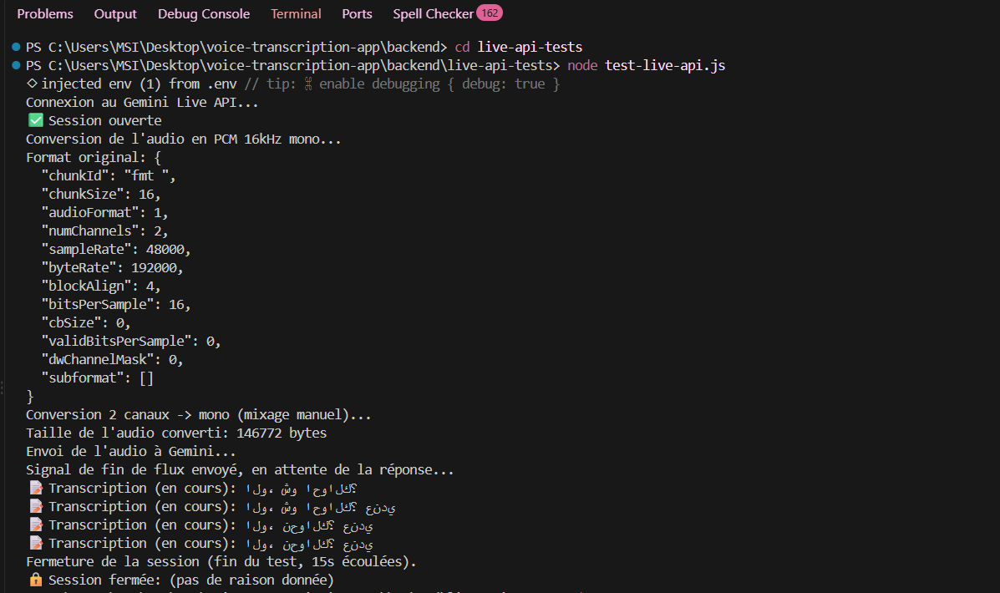
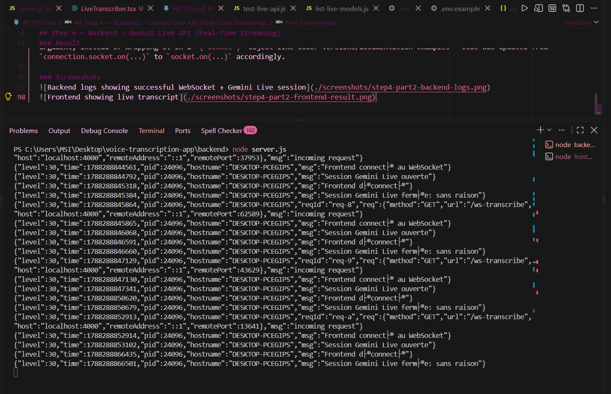
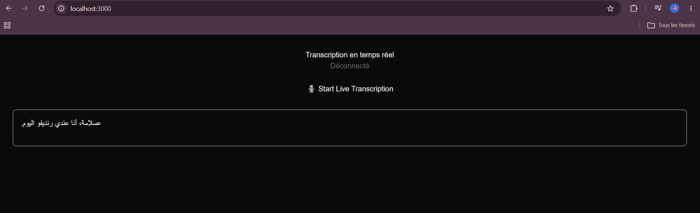
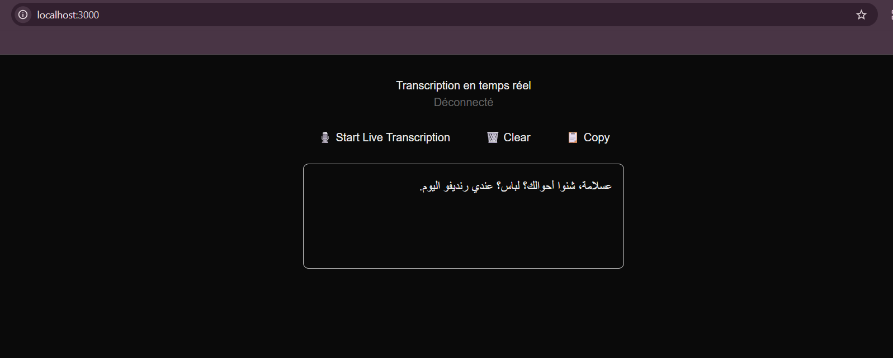

## Step 1 — Audio Recording (Frontend)

### What was built
A React component (`AudioRecorder.tsx`) that lets the user record their voice from the browser microphone, then play back the recording. Later redesigned with a full branded UI (header, footer, animated voice rings around the record button).

### Why this approach
Used the browser's native `MediaRecorder` API no external library needed, works directly in Next.js with `"use client"`. Audio chunks are collected as they're captured and assembled into a single Blob once recording stops, then converted to a temporary URL so it can be played back immediately in an `<audio>` element.

### How it was tested
Tested manually in the browser: clicked Start, spoke, clicked Stop, then played back the result to confirm the microphone was captured correctly. No backend involved yet, so no Postman/API testing needed at this stage.

### Result
Microphone permission prompt worked correctly, recording and playback worked as expected. Later redesigned the UI with a branded look (violet/teal/coral palette, animated voice rings during recording) confirmed working after the redesign too.

### Screenshots

## Step 2 — Frontend → Backend (Audio Transport)

### What was built
A Fastify server with two routes: a GET `/` route to check the server is alive, and a POST `/transcribe` route that receives an audio file and confirms it was received (filename + size in bytes). No connection to Gemini yet this step only validates the transport layer.

### Why this approach
Used `@fastify/multipart` to handle file uploads since the frontend will send audio as `multipart/form-data`. Used `@fastify/cors` to allow requests from the frontend (`localhost:3000`) once it's connected — without it, the browser would block the request due to CORS policy.

### How it was tested
Tested with Postman instead of the real frontend, to isolate and confirm the backend works correctly on its own before connecting it to anything else. Two tests: a simple GET request to confirm the server responds, and a POST request with a real audio file (`ma-phrase.mp3`) sent as form-data to confirm the upload and file-reading logic works.

### Result
Both tests passed with `200 OK`. The GET request returned the expected status message. The POST request correctly received the audio file, read its size (150,281 bytes), and returned it in the response confirming the backend can receive and process an audio file before Gemini is even connected.

### Screenshots

## Step 3 — Backend → Gemini (Basic Upload)

### What was built
Updated the `/transcribe` endpoint to send the received audio file to the Gemini API (`gemini-3.6-flash`) instead of just confirming receipt. The backend now returns the actual transcription text produced by Gemini.

### Why this approach
Used the official `@google/genai` SDK to call Gemini directly from the backend, with the model `gemini-3.6-flash`. The API key is stored in `backend/.env` (never committed, protected by `.gitignore`) and loaded with `dotenv`. The audio file is converted to base64 and sent as inline data. Added a fallback for the MIME type (`application/octet-stream` → `audio/mp3`) since Postman doesn't always set the correct MIME type on the uploaded file. The prompt instructs Gemini to transcribe only clearly spoken words, ignore background noise, and return an empty string if nothing is clearly said  this avoids Gemini hallucinating words from silence/noise, one of the issues identified during the research phase testing.

### How it was tested
Tested with Postman, same pattern as Step 2: a POST request to `/transcribe` with an audio file attached as form-data. This time the response contains a real transcription instead of just the filename/size, confirming the backend successfully talks to Gemini's API (not just the browser playground used during the research phase).

### Result
The request returned `200 OK` with a working transcription. 
This confirms the backend → Gemini connection works correctly for basic (non-streaming) upload, before moving on to the real-time Live API in Step 4.

### Screenshots

## Step 4 — Backend → Gemini Live API (Real-Time Streaming)

### What was built
An isolated test script (`backend/live-api-tests/test-live-api.js`) that validates the Gemini Live API connection independently, before integrating it into the real backend/frontend flow. Also built a helper script (`list-live-models.js`) to query which Live-capable models are actually available for our API key, since guessing model names caused several failed attempts.

### Why this approach
The Live API requires raw PCM audio (16-bit, 16kHz, mono) instead of a regular audio file like Step 3 so a WAV file first needs its sample rate, bit depth, and channel count converted manually. Chose to validate this connection alone first (isolated script, pre-recorded audio, no frontend/WebSocket yet) to isolate potential failure points: is the problem the Gemini connection itself, or the real-time streaming/WebSocket layer? Testing everything at once would make debugging much harder.

Used the model `gemini-3.5-transcribe-live` (found via the model-listing script) instead of a generic "flash-live" model, since it's purpose-built for transcription rather than full conversational audio responses. Set `responseModalities: [Modality.TEXT]` since we only need text output, not a spoken audio reply from Gemini.

### How it was tested
Ran the script directly with Node (`node test-live-api.js`) using a pre-recorded `.wav` file, and logged every message received from the Live API session to see the raw response structure, since the exact field names weren't obvious from documentation alone.

### Result
Successfully received real-time, incremental transcription of Tunisian Derja audio. The correct response field is `serverContent.interimInputTranscription.text` (not `inputTranscription` as initially assumed) — transcription arrives progressively as partial/interim results while more audio is processed, confirming the streaming behavior works as expected.

Issues resolved along the way:
- Original test audio file was stereo, 48kHz — had to manually downmix to mono and resample to 16kHz (the `wavefile` library's `toMono()` method doesn't exist in the installed version, so channel averaging was done manually)
- Initial model names (`gemini-3.1-flash-live-preview`, `gemini-live-2.5-flash`) were invalid or unsupported — resolved by querying available models directly via the API instead of guessing

This confirms the core Gemini Live connection works correctly. Next: connect this to a real WebSocket relay between the frontend microphone and the backend, instead of a pre-recorded file.

### Screenshots

### Part 2 — Full real-time integration (frontend mic → backend → Gemini Live)

### What was built
A full real-time pipeline: the frontend (`LiveTranscriber.tsx`) captures raw microphone audio using the Web Audio API, converts it to 16-bit PCM at 16kHz on the fly, and streams it continuously to the backend over a WebSocket (`/ws-transcribe`). The backend opens a Gemini Live session per connection, relays every audio chunk it receives straight to Gemini, and relays back every transcription update to the frontend, which displays it live as the user speaks.

### Why this approach
Unlike Step 2/3 (record everything, then send one file), true real-time requires sending small audio chunks continuously while recording. Used `ScriptProcessorNode` from the Web Audio API to access raw audio samples in ~4096-sample chunks as they're captured (note: this API is deprecated in favor of `AudioWorklet`, but still works reliably; a future improvement could migrate to `AudioWorklet`). Each chunk is downsampled from the browser's native rate (usually 44.1kHz/48kHz) to 16kHz and converted from Float32 to Int16 PCM manually, since the browser doesn't capture audio in that format natively. A WebSocket (via `@fastify/websocket`) was used instead of HTTP because it keeps a persistent two-way connection open, which HTTP requests can't do.

### How it was tested
Manual end-to-end test: started the backend and frontend servers separately, clicked "Start Live Transcription," granted microphone permission, and spoke a Tunisian Derja sentence while watching both the browser UI and the backend terminal logs simultaneously.

### Result
Real-time transcription worked correctly end-to-end: the backend logs confirmed the WebSocket connection, the Gemini Live session opening, and clean disconnection when stopping. The frontend displayed the transcription updating live as speech was captured.

One bug fixed along the way: the installed version of `@fastify/websocket` passes the raw WebSocket directly as the handler's first argument, instead of wrapping it in a `{ socket }` object like older versions/documentation examples — code was updated from `connection.socket.on(...)` to `socket.on(...)` accordingly.

### Screenshots

## Step 5 — Display/Play Response (Frontend)

### What was built
Improved the transcript display in `LiveTranscriber.tsx`: instead of replacing the text on every update (losing previous sentences), the UI now keeps a running history. Finalized text (once Gemini signals `turnComplete`) is kept permanently, while the current in-progress transcription shows separately in italic/grey until it's finalized. Added a "Clear" button to reset the transcript and a "Copy" button to copy the full text to the clipboard. The transcript box also auto-scrolls to the bottom as new text arrives.

### Why this approach
The backend wasn't originally forwarding a clear "end of turn" signal to the frontend, so there was no reliable moment to "lock in" a finished sentence — `server.js` was updated to send a `turn_complete` message whenever Gemini's `serverContent.turnComplete` fires, which the frontend uses to move the current interim text into permanent history.

### How it was tested
Manual test: spoke a sentence, paused a few seconds (to let Gemini finalize the turn), then spoke a second sentence. Confirmed both sentences remained visible one after another instead of the second one overwriting the first.

### Result
Transcript history now persists correctly across multiple turns. Clear and Copy buttons work as expected.

### Screenshots
