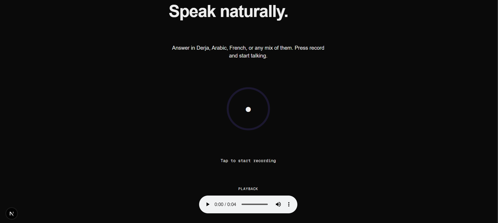
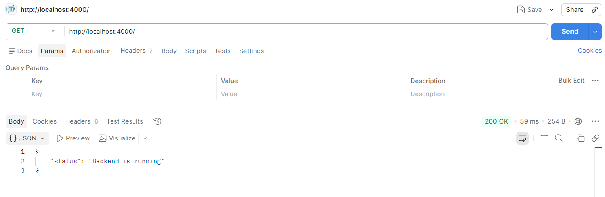
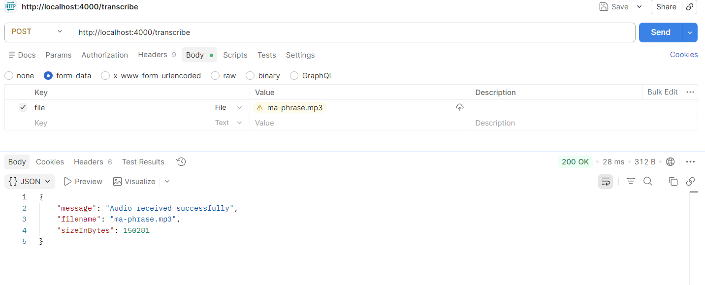
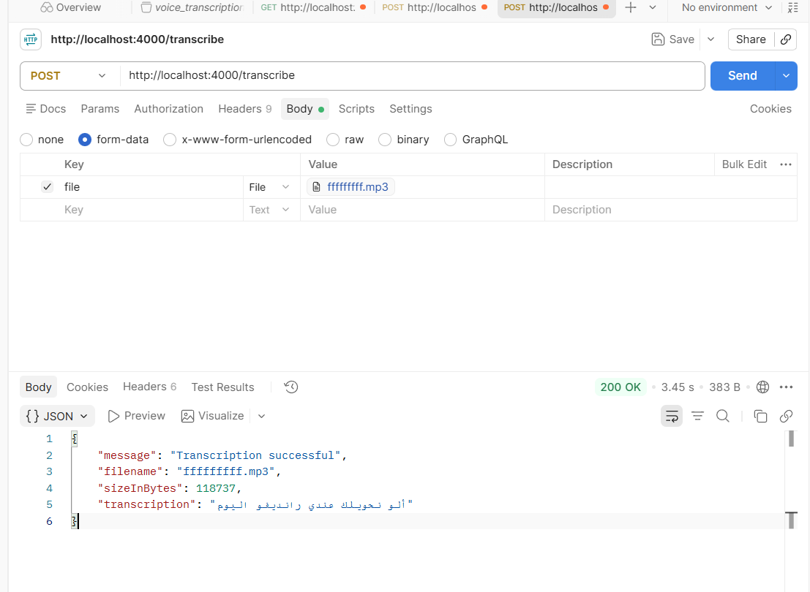

## Step 1 — Audio Recording (Frontend)

### What was built
A React component (`AudioRecorder.tsx`) that lets the user record their voice from the browser microphone, then play back the recording. Later redesigned with a full branded UI (header, footer, animated voice rings around the record button).

### Why this approach
Used the browser's native `MediaRecorder` API no external library needed, works directly in Next.js with `"use client"`. Audio chunks are collected as they're captured and assembled into a single Blob once recording stops, then converted to a temporary URL so it can be played back immediately in an `<audio>` element.

### How it was tested
Tested manually in the browser: clicked Start, spoke, clicked Stop, then played back the result to confirm the microphone was captured correctly. No backend involved yet, so no Postman/API testing needed at this stage.

### Result
Microphone permission prompt worked correctly, recording and playback worked as expected. Later redesigned the UI with a branded look (violet/teal/coral palette, animated voice rings during recording) confirmed working after the redesign too.

### Screenshots

## Step 2 — Frontend → Backend (Audio Transport)

### What was built
A Fastify server with two routes: a GET `/` route to check the server is alive, and a POST `/transcribe` route that receives an audio file and confirms it was received (filename + size in bytes). No connection to Gemini yet this step only validates the transport layer.

### Why this approach
Used `@fastify/multipart` to handle file uploads since the frontend will send audio as `multipart/form-data`. Used `@fastify/cors` to allow requests from the frontend (`localhost:3000`) once it's connected — without it, the browser would block the request due to CORS policy.

### How it was tested
Tested with Postman instead of the real frontend, to isolate and confirm the backend works correctly on its own before connecting it to anything else. Two tests: a simple GET request to confirm the server responds, and a POST request with a real audio file (`ma-phrase.mp3`) sent as form-data to confirm the upload and file-reading logic works.

### Result
Both tests passed with `200 OK`. The GET request returned the expected status message. The POST request correctly received the audio file, read its size (150,281 bytes), and returned it in the response confirming the backend can receive and process an audio file before Gemini is even connected.

### Screenshots

## Step 3 — Backend → Gemini (Basic Upload)

### What was built
Updated the `/transcribe` endpoint to send the received audio file to the Gemini API (`gemini-3.6-flash`) instead of just confirming receipt. The backend now returns the actual transcription text produced by Gemini.

### Why this approach
Used the official `@google/genai` SDK to call Gemini directly from the backend, with the model `gemini-3.6-flash`. The API key is stored in `backend/.env` (never committed, protected by `.gitignore`) and loaded with `dotenv`. The audio file is converted to base64 and sent as inline data. Added a fallback for the MIME type (`application/octet-stream` → `audio/mp3`) since Postman doesn't always set the correct MIME type on the uploaded file. The prompt instructs Gemini to transcribe only clearly spoken words, ignore background noise, and return an empty string if nothing is clearly said  this avoids Gemini hallucinating words from silence/noise, one of the issues identified during the research phase testing.

### How it was tested
Tested with Postman, same pattern as Step 2: a POST request to `/transcribe` with an audio file attached as form-data. This time the response contains a real transcription instead of just the filename/size, confirming the backend successfully talks to Gemini's API (not just the browser playground used during the research phase).

### Result
The request returned `200 OK` with a working transcription. 
This confirms the backend → Gemini connection works correctly for basic (non-streaming) upload, before moving on to the real-time Live API in Step 4.

### Screenshots

